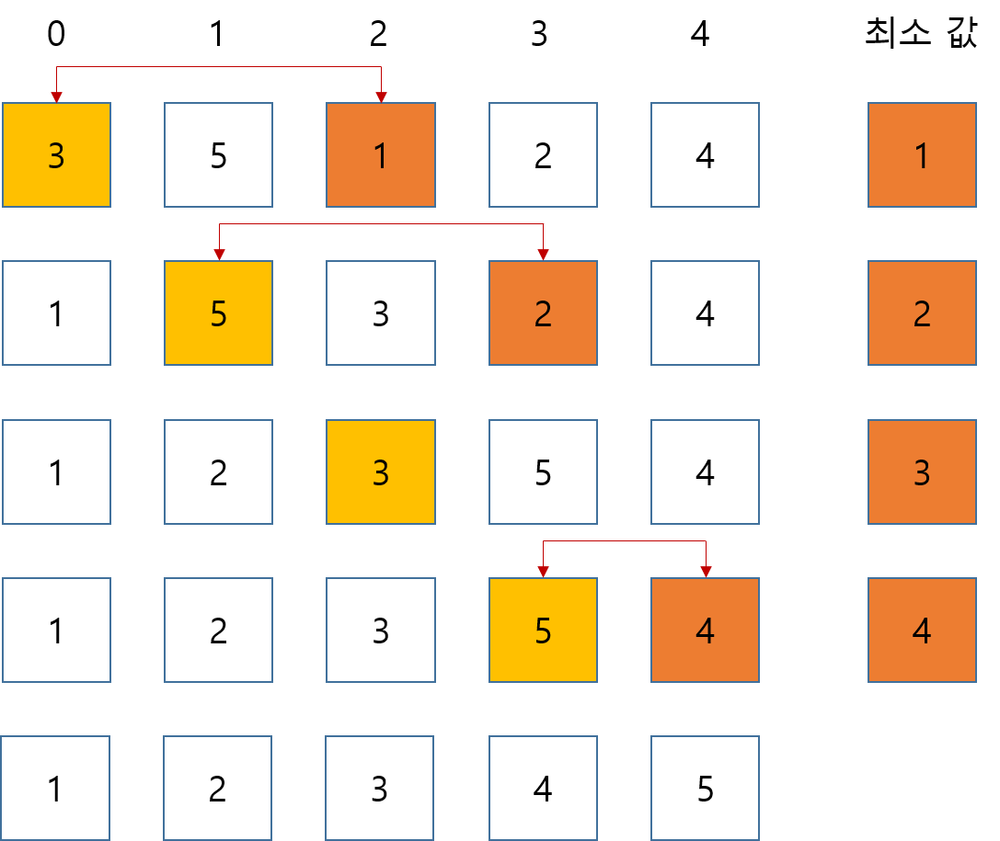

## 선택 정렬(Selection sort)
학생때 알고리즘 시간에 공부했던 내용이지만,
최근에 정보처리기사 공부, 알고리즘 공부를 하면서 겸사 겸사 되짚어 보았다.

## 이론
주어진 배열을 순회하면서 선택된 항목과 그 다음 항목들 중에 최소 값을 찾아서 서로 교환해준다.
아래의 그림을 보면서 이해하면 느낌이 올 것이다.
노란색은 선택된 항목, 주황색은 최소 값이다.



## 소스코드
역시 개발자는 소스코드로 확인하는 편이 이해가 빠르다.

한 라인에 배열을 "3 5 1 2 4" 형식으로 공백구분으로 받은 후
배열을 순회하면서 최소 값의 index를 구하고 선택된 항목과 교환하는 내용이다.

```py
arr = list(map(int, input().split()))

for i in range(len(arr)):
    min_idx = i
    for j in range(i + 1, len(arr)):
        if arr[min_idx] > arr[j]:
            min_idx = j

    arr[i], arr[min_idx] = arr[min_idx], arr[i]

print(' '.join(map(str,arr)))
```
