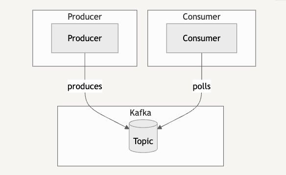
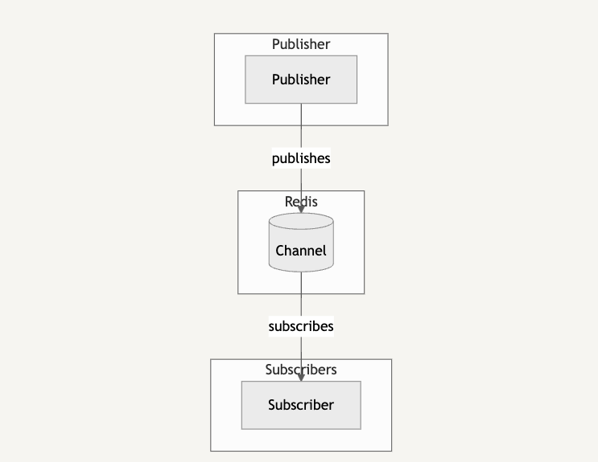

## 개요

Redis의 pub/sub은 MSA에서 모듈간의 데이터 교환을 위해 사용되는 Messaging service의 용도로 redis를 활용하는 방법이다.

채팅, 구독, 푸시 알림, 결제 시스템 등에 사용된다.

## Messaging Service란

MSA같은 분산 시스템에서 모듈간 메시지를 교환하기 위한 통신 방법이다. 시스템간 Coupling을 낮추고 확장성을 높인다.

시스템간 Coupling을 낮추고 독립적으로 운영되게 할 수 있는 이유는 데이터 교환을 비동기적으로 처리할 수 있기 때문이다.

## Redis pub/sub의 구성요소

Publisher: 메시지를 구독자에게 발행한다. pub 메시지는 저장되지 않기 떄문에 Subscriber가 존재하지 않으면 메시지가 사라지게 된다.

Subscriber: 구독 중인 Topic에 대하여, Publisher의 메시지를 수신 받는다.

Channel(Topic): 발행된 메시지를 받고 구독자에게 메시지를 전달해주는 역할을 한다. Topic이 있음으로써 각각의 관심사가 분리되어 발행자와 구독자가 Loose Coupling이 된다.

## Kafka와의 차이점

### Kafka 특징



- Consumer가 주기적으로 Topic에 메시지가 있는지 확인하면서 메시지를 Polling한다.
- Topic에서 메시지를 가져가도 바로 삭제되지 않는다. 보관 주기, 용량이 초과되면 삭제된다.
- Consumer가 메시지를 읽고 확인할 수 있어 메시지의 처리 상태를 추적할 수 있다.
- Consumer들은 하나의 Consumer Group로 관리된다.
- Consumer는 각자 offset을 가지고있고 메시지를 어디까지 읽었는지 기록한다.

### Redis 특징



- Channel은 Subscriber가 구독하는 순간에 생성된다.
- Publisher가 Channel에 발행을 하게 되면 해당 Channel을 구독하고 있는 모든 Subscriber에게 메시지가 전송된다.
- 메시지를 일방적으로 발행하기 때문에 Subscriber가 정상 수신했는지 확인하지 않는다.
- Kafka와 다르게 polling이 아닌 채널로부터 수신받는 방식이다.
- Group이 없기 때문에 Subscriber들은 채널의 모든 메시지를 수신 받는다.
- Subscriber는 특정 패턴을 통해 채널을 구독할 수 있다.

#### Kafka, Redis 비교

- 메시지 저장 여부
  - Kafka: 토픽에 일정 기간동안 메시지를 저장할 수 있음
  - Redis: 메시지가 Subscriber에게 전송되면서 채널에서 바로 삭제됨
- 메시지 수신 방식
  - Kafka: Consumer가 polling방식으로 Topic에서 메시지를 가져감
  - Redis: 채널에서 Subscriber에게 메시지를 발송
- 전송보장
  - Kafka: ack 옵션에 따라 보장 가능
  - Redis: 메시지를 수신했는지 따로 확인하지 않음
- 지연시간
  - Kafka: 메시지에 대해 ack 옵션에 따라 작업이 있어서 redis에 비해 비교적 느리다
  - Redis: In-memory 기반이고, 수신확인 같은 작업이 없어서 kafka에 비해 가볍고 빠르다
- 메시지 수신 단위(여러 인스턴스가 있는 환경)
  - Kafka: 여러 인스턴스가 같은 Consumer Group에 묶여있기 때문에 하나의 인스턴스에서만 메시지를 수신한다.
  - Redis: 각 Subscriber 단위로 메시지를 수신한다.

## 정리

낮은 Latency와 모든 인스턴스가 동일한 데이터가 필요한 경우엔 → Redis pub/sub을 사용하면 된다.

의존성을 분리하고 특정 이벤트를 중복없이(멱등성) 1건만 받아야 하는 경우에 Kafka 사용하면 된다.

## 실습해보기

이 실습환경에선 docker로 redis를 띄우고 해당 컨테이너에 redis-cli를 2개 띄운다.

1. Subscriber) redis-cli로 접근한다.
2. Subscriber) `test-channel` 라는 이름의 채널을 구독한다. (구독과 동시에 채널 생성, 구독 모드로 전환됨)
3. Publisher) redis-cli로 접근한다.
4. Publisher) `pubsub channels`로 채널 목록을 확인한다.
5. Publisher) `publish test-channel "hello world!"` 로 메시지를 발행한다.
6. Subscriber) 메시지를 잘 수신하는 것을 확인할 수 있다.

terminal 1 (Publisher)

```bash
docker exec -it f834e54cbcdbff0882c2da9909369242e56acd5c8e790642db248d7e8c1f6f6f /bin/sh
# cli 접근
$ redis-cli

# 채널 목록을 확인한다.
$ pubsub channels
# 1) "test-channel"

$ publish test-channel "hello world!"
# (integer) 1
```

terminal 2 (Subscriber)

```bash
docker exec -it f834e54cbcdbff0882c2da9909369242e56acd5c8e790642db248d7e8c1f6f6f /bin/sh
# cli 접근
$ redis-cli

# test-channel이라는 채널을 구독한다.
$ subscribe test-channel
# subscribed mode로 접근(대기 받는 상태가 됨)

# 1) "message"
# 2) "test-channel"
# 3) "hello world!"
```
