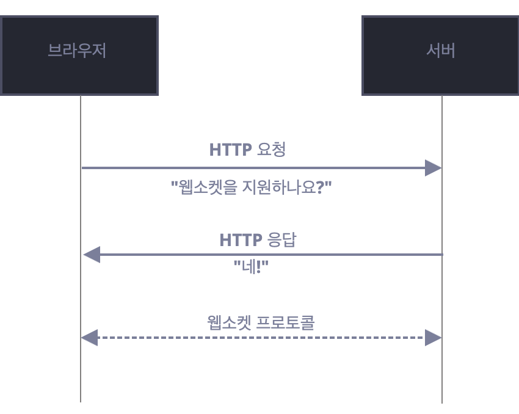
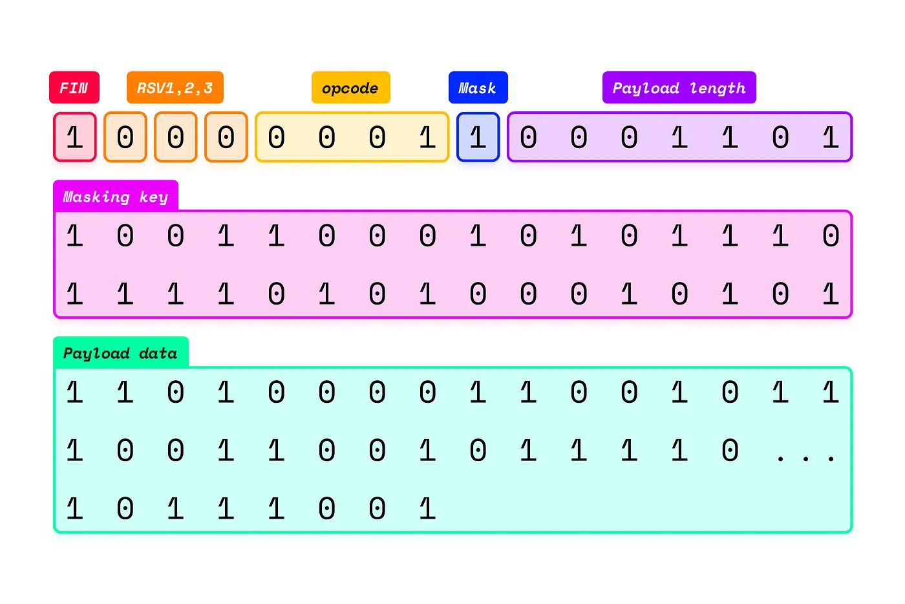

## Web Socket이란

Web Socket은 전이중 통신 프로토콜(Full duplex)로써, 채팅, 알림, 음성 또는 화상 통화 같은 실시간 애플리케이션에 적합한 통신 방식이다.
웹 소켓을 사용하면 서버와 클라이언트 간에 양방향 대화형 통신 세션을 열 수 있다.
서버에 메시지를 보내고 응답을 위해 서버를 Polling하지 않아도 응답을 받을 수 있다.

## WebSocket 구성요소

### WebSocket Protocol

- 프로토콜: `ws://` (port: 80), `wss://` (port: 443)
- 핸드쉐이크
    - Request: 클라이언트가 Websocket 서버에 HTTP 요청을 보낸다.
    - Header:
        Upgrade: websocket
        Connection: Upgrade
        Sec-WebSocket-Key: 클라이언트에서 생성한 Base64 인코딩된 임의의 문자열
        Sec-WebSocket-Version: WebSocket 프로토콜 버전 (최소 13)
    - Response: 101 Switching Protocols



- 메시지 프레임 구조
    
    메시지는 여러 frame으로 전송 된다. 각 frame의 구조는 다음과 같다.
    
    - FIN bit: 메시지의 마지막 프레임인지 여부(1bit)
    - Reserved bits: 후속 확장을 위해 예약된 bits(3bit)
    - OpCode: 메시지의 타입을 나타내는 코드(text, binary, close 등) (4bit)
    - Mask: 클라이언트가 메시지를 masking했는지 여부(1bit)
    - Masking Key(클라이언트에서 전송하는 경우): 4bytes의 key(masking이 적용된 경우)
    - Payload Length: payload의 길이 (7, 7+16, 7+64 bit 중 선택)
    - Payload Data: 전송할 데이터
    
    
    

### WebSocket API

소켓은 다음과 같이 생성한다.

```tsx
const socket = new WebSocket("ws://suitee.me");
```

**소켓의 이벤트**

- `open` - 커넥션이 제대로 만들어 졌을 때 발생
- `message` - 데이터를 수신했을 때 발생
- `error` - 에러가 생겼을 때 발생
- `close` - 커넥션이 종료되었을 때 발생

정상적인 생명주기의 소켓은 open-message-close의 순서로 이벤트가 진행된다.

**소켓의 메서드**

- `send(data)`: 서버에 메시지를 전송
- `close(code, reason)`: 연결을 닫음

**소켓의 연결 종료 코드**

- `1000` - 정상 종료를 의미
- `1006` - 커넥션이 유실되었음을 의미
- `1001` - 연결 주체 중 하나가 떠남을 의미
- `1009` - 메시지가 너무 큼을 의미
- `1011` - 서버 측에서 비정상적인 에러 발생

## vs HTTP - 실시간 애플리케이션 관점

HTTP는 Request-Response 프로토콜로써 클라이언트가 서버에 Request를 요청하고 Response를 제공 받을때까지 Polling합니다. 응답을 받으면 통신이 종료된다.
HTTP가 열려있는 동안에는 반이중 통신만 가능하여 통신이 단방향으로만 진행된다.
*HTTP/2, HTTP/3은 기본적으로 연결을 유지하고 이 상태에서 여러 요청을 동시에 보낼 수 있다.(Multiflexing)
하지만 실시간 채팅과 이벤트 스트리밍과 같은 실시간 통신을 위한 용도는 아니다.

### HTTP

- HTTP는 상태가 없고 독립적이기 때문에 정적 콘텐츠나 데이터의 응답을 캐싱하면 웹사이트 성능이 향상될 수 있다.
- HTTP 연결은 Long Polling을 통해 실시간과 유사한 기능을 만들 수 있다. 하지만 HTTP요청은 무기한 열려있을 수 없고, 클라이언트는 정기적으로 새로운 Long Polling을 열어야 한다.
- HTTP Streaming을 사용하면 지속적인 데이터 스트림을 위해 연결이 무기한 열린 상태로 유지되고 개념적으론 WebSocket과 비슷하지만, HTTP이기 때문에 여전히 단방향이다. 클라이언트는 HTTP Streaming을 통해 서버에 메시지를 보낼 수 없다.
- HTTP는 3way handshaking, 세션 수명동안 여러 연결을 처리해야 하기 때문에 WebSocket에 비해 더 많은 시간과 리소스를 소비하게 된다.

### Web Socket

- 연결된 상태에서 양쪽이 언제든 메시지를 보낼 수 있기 때문에 데이터를 빠르게 주고 받아야 할 때 효과적이다.
- Web Socket은 서버가 전이중 채널에서 통신하기 때문에 클라이언트, 서버 모두 오랫동안 지속되는 연결 환경에서 동시에 데이터를 보낼 수 있고, 이로인해 HTTP Polling에 비해 오버헤드가 적다.
- Polling 과정 없이 사용 가능한 데이터가 즉시 전송되기 때문에 클라이언트가 계속 Request할 필요가 없다.
- HTTP와 다르게 상태가 존재하기 때문에 연결이 활성화된 상태인지 어떤 데이터를 보고있는지 등의 정보를 유지할 수 있다.

## Appendix

https://ko.javascript.info/websocket
https://developer.mozilla.org/en-US/docs/Web/API/WebSockets_API
https://sendbird.com/ko/developer/tutorials/websocket-vs-http-communication-protocols
