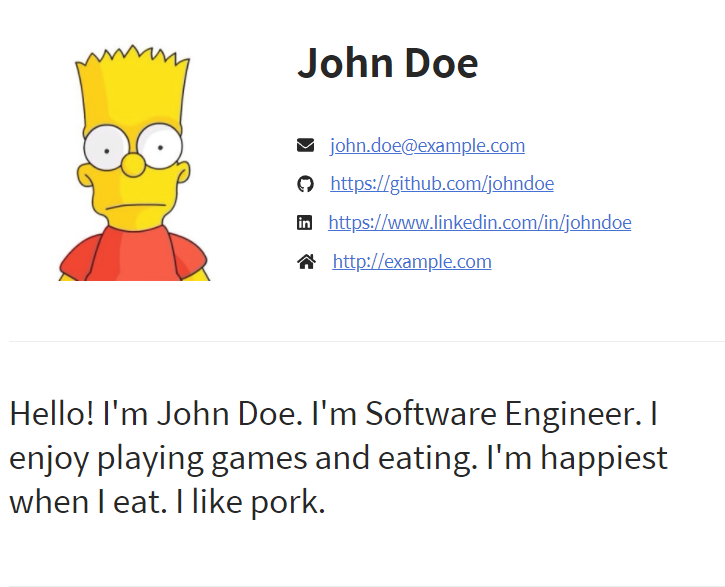
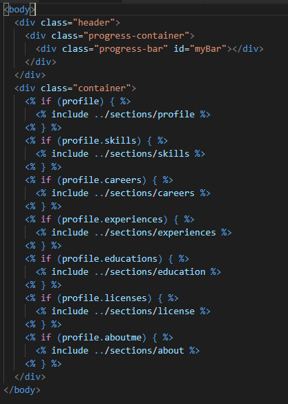
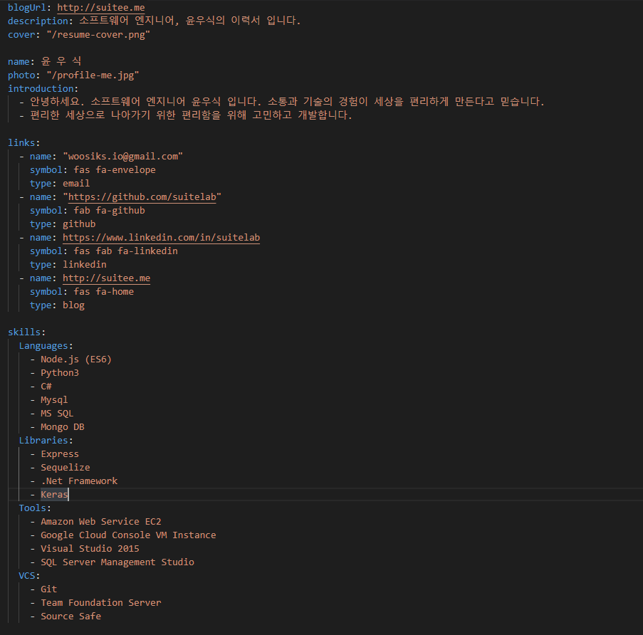

> Demo 링크 : (http://resume.suitee.me/)  
> Github 링크 : (https://github.com/suitelab/simple-resume)

이직을 준비하며 지난 주말에 문득 생각이 들었다. "이력서 생성기를 만들어볼까?"  
MS Word로 작성해둔 나름 이쁘게 디자인했다고 생각되는 이력서가 하나 있다.  

하지만 여간 귀찮은 부분이 한두가지가 아니다.  
다른 작성 환경에서 이력서 작성시 사용한 폰트도 새로 다운받아 줘야하고 양식을 변경하거나 이력 등을 추가할때 틀을 유지시키려고 할 때 신경써줘야할 부분이 많다. (물론 MS Word에 익숙하지 않은 탓도 있다.)  

이런 저러한 이유로 현재 이 블로그의 정적 웹페이지 생성기에서 영감을 얻은 이력서 생성기가 만들고 싶어졌다.  

요즘 한창 node.js를 공부하고 있기 때문에 node.js로 구현하고 싶었다.  
기능은 다음과 같이 간단하게 생각해보았다.

- express 서버로 개발할 것.
- yaml파일로 작성하여 폰트 등등 사용자가 신경쓸부분을 줄이기.
- 경력사항등 항목들을 자유자재로 커스텀마이징 할 수 있을 것.
- pdf 변환기능을 제공할 것.

우선 이력서 디자인은 프론트엔드 분야와 썩 친하지 않기때문에 굉장히 깔끔하고 직관적이라고 생각이 든 https://hyunseob.github.io/resume/ 에서 많은 부분 참고를 하였다. 심지어 코드마저 깔끔하다.  
이현섭님 감사드립니다!

# express 서버로 개발할 것.

사실 node.js를 사용하겠다고 했지만 막상 사용한 부분은 서버 구동과 pdf변환 정도로만 사용한 것 같다. 심지어 route도 없다.(simple is best 👍)

html쪽은 생산성이 좋은 템플릿 엔진 ejs를 사용하였고 구조는 다음과 같이 section 별로 나누었다.  
현재 education과 license의 양식이 거의 동일하기 때문에 합치는게 좋을지 유지할지 고민중이다.  

# yaml파일로 작성하여 폰트 등등 사용자가 신경쓸부분을 줄이기.

이력서 작성은 yaml을 사용함으로써 작성할때 광장히 직관적이고 편리하다.  
물론 작성항목들도 최대한 직관적으로 구성해보았다. 그리고 각 카테고리마다 이모지도 달아서 좀 더 눈에 잘 들어오게 하였다.

# 경력사항등 항목들을 자유자재로 커스텀마이징 할 수 있을 것.

구조가 저렇기 때문에 유저가 원하는 입맛대로 항목들을 추가, 삭제할 수 있는 장점이 있다.  예를들어 license 항목이 필요없는 사용자의 경우 yml에서 license 부분을 주석처리하면 끝이다.  
반대로 항목을 추가하고 싶은 사용자는 ejs파일과 yml에서 항목을 추가해서 사용하면 된다!

# pdf 변환기능을 제공할 것.
이부분 고민을 많이 하였다. 이력서는 요새 pdf로 제출하는 것이 트렌드라서 pdf로 변환해주는 기능이 필요하다고 생각되었다.  
사실 브라우저에서 pdf로 출력 기능을 제공하기 때문에 그렇게 이용하고 싶은 사람은 저 방법대로 해도 좋다!  
pdf출력 기능을 검색하던 중 npm 패키지인 [puppeteer](https://github.com/GoogleChrome/puppeteer)라는 Google Chrome에서 만든 패키지가 있었다.  

chrome에서 pdf로 출력하는 기능을 puppeteer에서 그대로 메서드로 제공하고 있어서 쉽게 pdf로 변환할 수 있게되었다.  
pdf 변환기능은 `npm run pdf {path/to/file/name}` 의 명령어로 사용할 수 있다.  
파라미터에 원하는 경로/파일이름 으로 입력하면 해당 경로에 pdf파일로 저장하게 된다.  

원래 본인이 쓰려고 만든 서비스지만 커스텀 이력서를 작성하고 싶은 많은 분들께 도움이 되고 싶어서 오픈소스로 공개하게 되었다.  

개인이 만든 서비스이기 때문에 불편한점이나 버그가 있을 수 있다.
(https://github.com/suitelab/simple-resume) 에서 Issues, Pull requests를 받고 있으니 자유롭게 작성해주시면 서비스 개선에 도움이 될 것 같다.

글과 서비스가 도움이 되셨다면 repository의 ⭐(Star) 많이 눌러주세요!  

# 🛴
