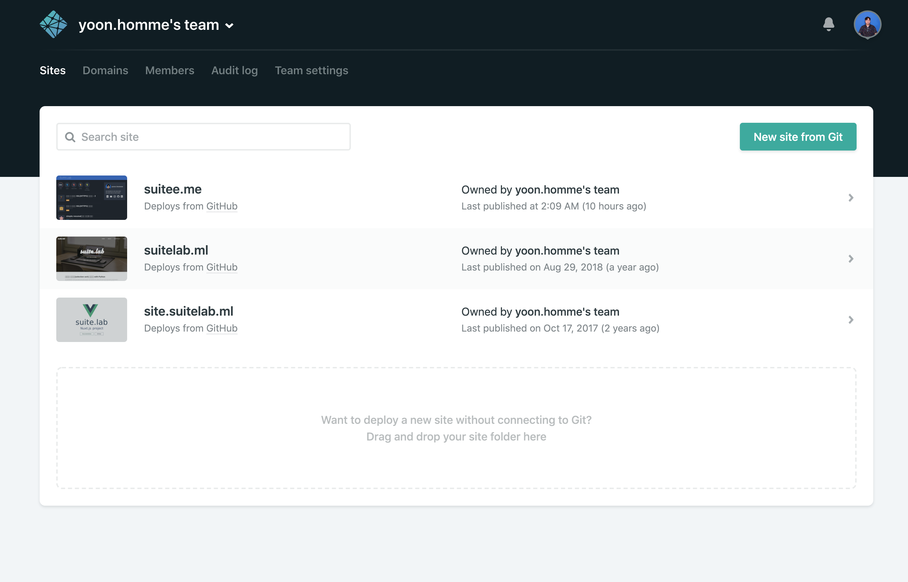
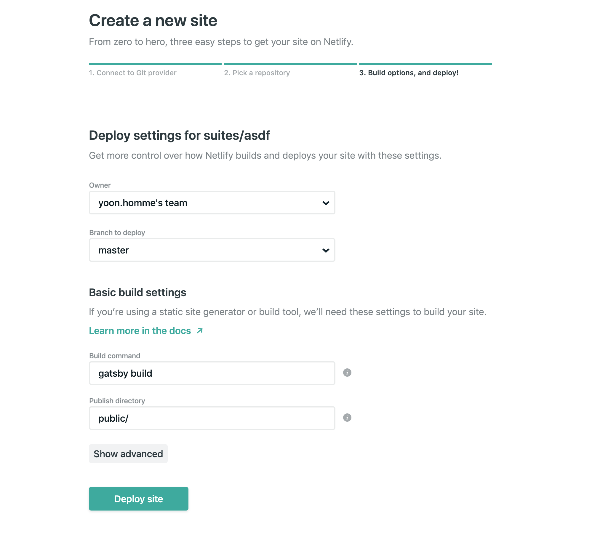
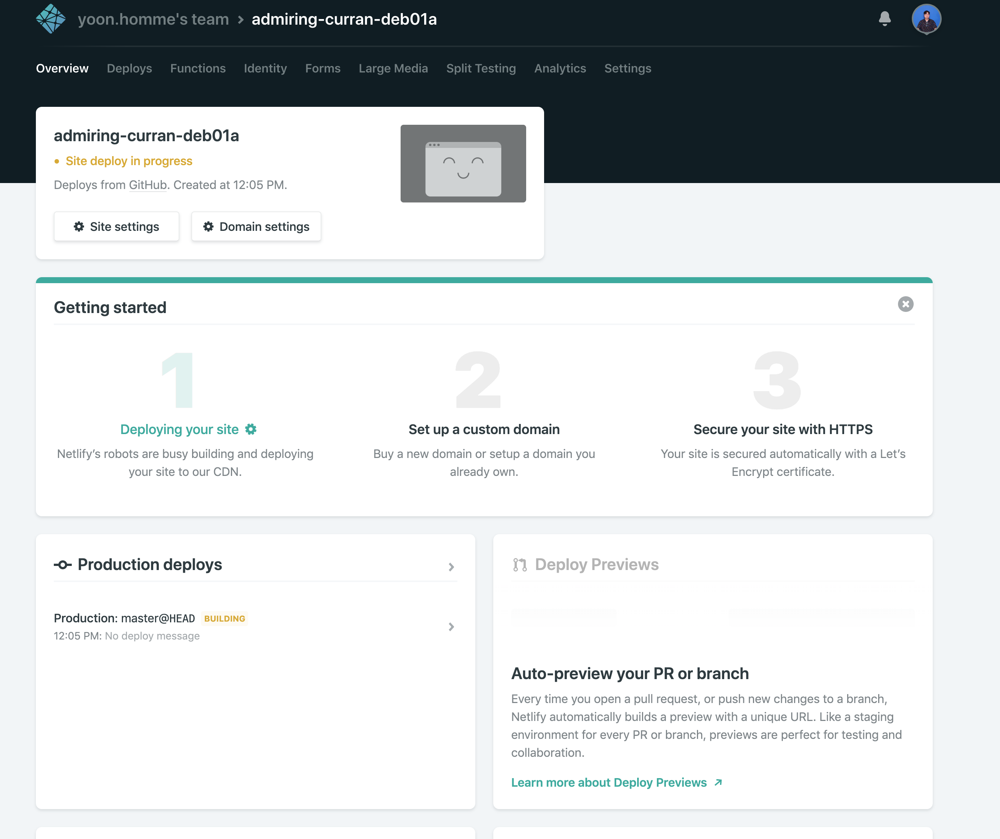
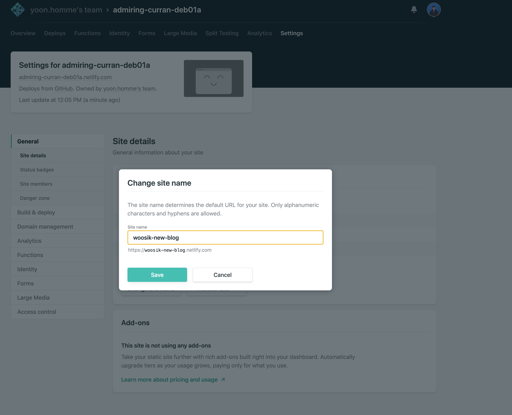

## Gatsby가 무엇인가
React와 Graphql을 사용하는 정적페이지 생성기.
Gatsby JS 는 가공할 정보를 GraphQL 에서 가져와서 빌드 시점에 정적 페이지를 만들어 내는 방식을 취하고 있다.
이미 배포할때 각 페이지 정보들이 모두 배포시점에 만들어지므로, 따로 앱서버가 필요하지 않다는 장점이 있다.

- 그래프 형태의 데이터 인터페이스를 제공한다.
- 데이터 노드를 구성한다. 프리셋인 플러그인을 통해 확장할 수도 있다.
- 구성한 데이터를 GraphQL로 쿼리해서 페이지 코드에서 사용한다.
- 사이트의 모든 페이지를 사전에 렌더링하여 경로에 `index.html`을 생성한다.

## 다른 정적페이지 생성기가 아닌 Gatsby를 선택한 이유
Jekyll은 가장 많이 쓰이는 생성기지만 ruby로 작성되어있어서 custom하는데 쉽지않은 노력이 듦.
hexo는 node기반의 생성기지만 ejs등의 템플릿 코드를 작성해야해서 유지보수하기가 react에 비해 불편하다고 느낌.

## 템플릿 클론

해당 홈페이지에 많은 템플릿들을 확인할 수 있다.  
[https://www.gatsbyjs.org/showcase/?filters[0]=Featured](https://www.gatsbyjs.org/showcase/?filters%5B0%5D=Featured)

이번 클론용 예제는 다음의 프로젝트를 클론하여 사용하려고 한다.
[https://github.com/gatsbyjs/Gatsby-starter-blog](https://github.com/gatsbyjs/Gatsby-starter-blog)

```bash
npm install -g Gatsby-cli

git clone https://github.com/gatsbyjs/Gatsby-starter-blog.git my-blog
cd my-blog
npm i

rm -rf .git
git init
git add .
git commit -m "Init project"
``` 
```bash
git remote add origin git@github.com:suites/my-blog.git
git push -u origin master

npm run start

http://localhost:8000/
http://localhost:8000/___graphql
```
## 간단한 수정을 통해 내 블로그로 탈바꿈

gatby-config.js
```js
siteMetadata: {
    title: `우식의 블로그 입니다.`,
    author: `윤우식`,
...
```

src/components/bio.js
```html
<p>
  Written by <strong>{author}</strong> who lives and works in San
  Francisco building useful things.
  {` `}
  <a href={`https://twitter.com/${social.twitter}`}>
    You should follow him on Twitter
  </a>
</p>

<p>
  서울에 사는 <strong>윤우식</strong>입니다.
  {` `}
  <a href={`https://twitter.com/${social.twitter}`}>
    You should follow him on Twitter
  </a>
</p>
```
## 첫 게시글 작성

content/blog/make-a-blog/index.md
```md
---
title: 블로그를 만드는 방법
date: "2019-08-01T23:46:37.121Z"
---

### 요로코롬
만들면 됩니다.

- 노션 게시글
- 작성하듯이
- 작성하면 됩니다.
```

## netlify에 블로그 배포
이제 드디어 대망의 배포를 진행해볼 차례다. 아래의 주소로 가서 가입을 진행한다.
[https://www.netlify.com/](https://www.netlify.com/)

가입이 완료 되었으면 github repo와 netlify site를 연결해준다.










## 🐣 완성 🐣
자 여기까지 잘 따라왔다면 멋진 블로그가 완성되었을 것이다.
추가적인 플러그인 사용이나 예제를 보고싶다면 저자의 블로그 repo를 참고하면 도움이 될 수 있을 것 같다. 🤠
[https://github.com/suites/suitelab/](https://github.com/suites/suitelab/)

### 추가로 할 수 있는 작업들
- typescript로 전환
- Gatsby-plugin 설치(google-ad, webmaster, disqus ...) [https://www.gatsbyjs.org/plugins/](https://www.gatsbyjs.org/plugins/)
- react 관련 라이브러리 설치