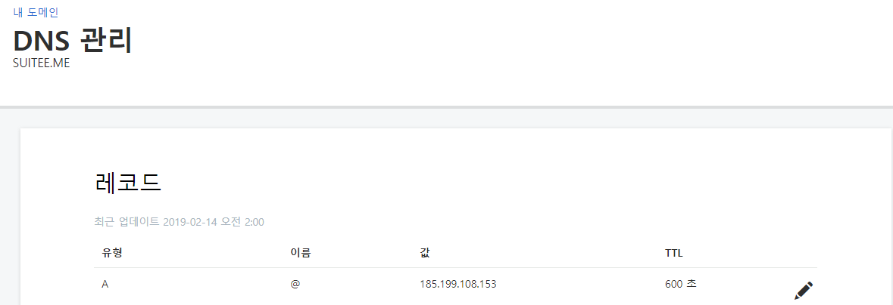
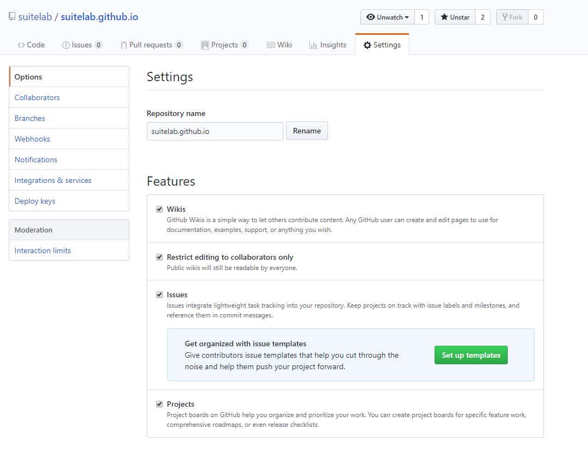
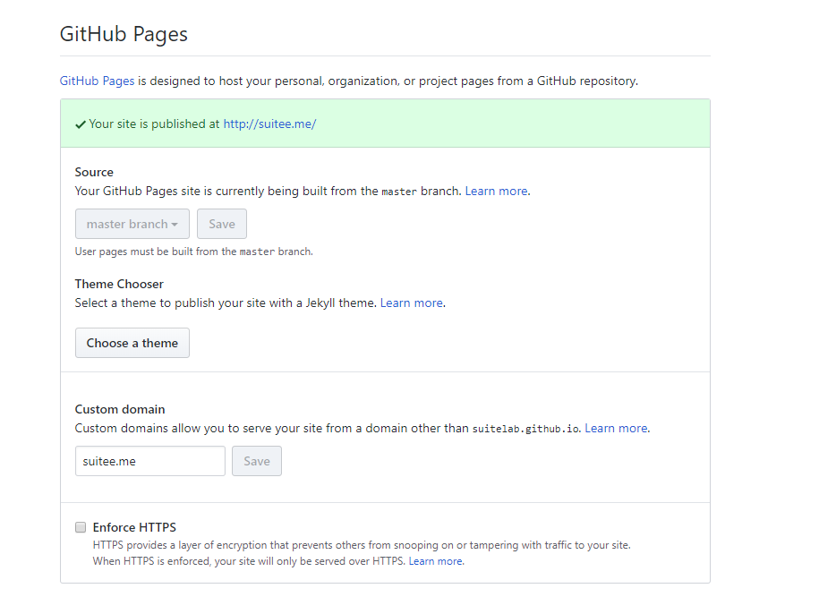
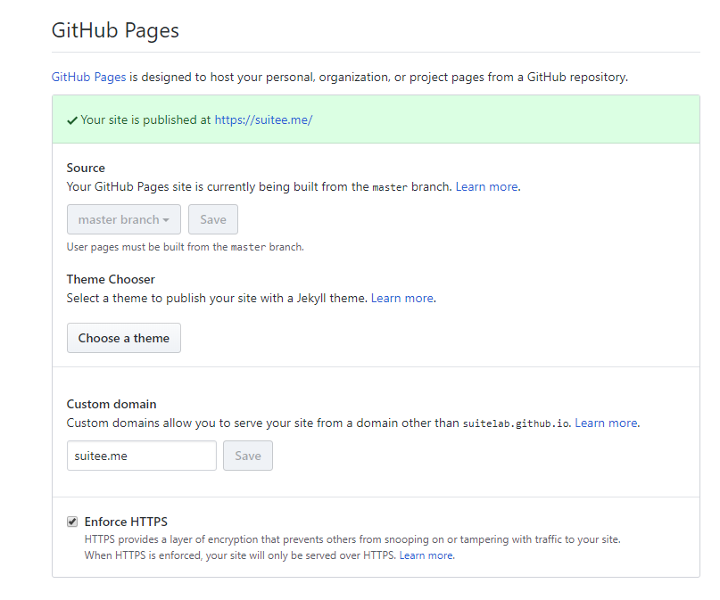
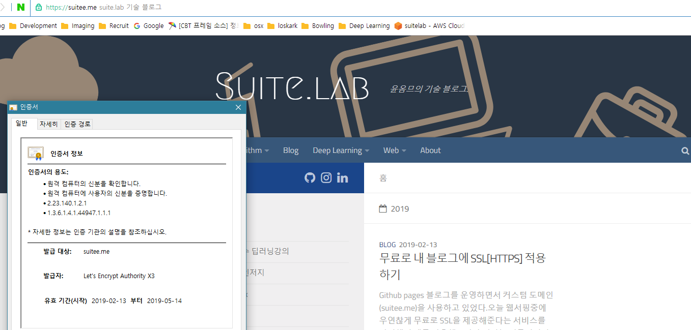

> 이전글 : [무료로 내 블로그에 SSL[HTTPS] 적용하기](https://suitee.me/2019/02/13/how-to-setup-free-ssl/)

이전글에 작성한 것 처럼 Github Pages 블로그에 Cloudflare를 적용하여 이용하고 있었는데 국내에서 Cloudflare를 서비스에 이용하면 꽤 느려질 수 있다는 댓글을보고 필자의 블로그를 모니터링을 해보았는데 체감상 꽤나 느려짐이 느껴졌다.

이 글에서는 필자가 새롭게 블로그에 적용한 Github Pages 블로그 이용자를 위한 HTTPS 적용방법을 소개하려고 한다.

HTTPS를 적용하기 전과 거의 차이없는 속도를 나타낸다.

### 선행 조건

> - 커스텀 도메인 사용자여야한다. (github.io 도메인은 이미 https가 적용되고 있음)
> - Cloudflare 등 HTTPS 서비스가 적용되고 있지 않아야한다. (블로그 주소가 http:// 로 시작되는 주소여야함)

## 1. 도메인 서비스에 레코드 추가

godaddy와 같은 필자가 이용하는 커스텀 도메인 서버에서 DNS관리 메뉴에 들어간다.
기존에 설정 되어있는 A 유형의 레코드의 값을 아래의 값들 중 하나로 변경 또는 추가 해준다.

- `185.199.108.153`
- `185.199.109.153`
- `185.199.110.153`
- `185.199.111.153`

필자는 `185.199.108.153` 를 사용하였다.



bash에서 dig 명령어를 통해 레코드 적용여부를 확인 할 수 있다.

```shell
$ dig suitee.me +nostats +nocomments +nocmd

; <<>> DiG 9.11.3-1ubuntu1.1-Ubuntu <<>> suitee.me +nostats +nocomments +nocmd
;; global options: +cmd
;suitee.me.                     IN      A
suitee.me.              600     IN      A       185.199.108.153

$ dig suitelab.github.io +nostats +nocomments +nocmd

; <<>> DiG 9.11.3-1ubuntu1.1-Ubuntu <<>> suitelab.github.io +nostats +nocomments +nocmd
;; global options: +cmd
;suitelab.github.io.            IN      A
suitelab.github.io.     600    IN      A       185.199.108.153
```

dig 명령어에서 본인의 블로그 원본 주소 {username}.github.io 와 커스텀 도메인 example.com 의 ip 값(ex: 185.199.108.153)이 같으면 성공이다.

적용까지는 시간이 조금 걸리는 것 같다. (수십분 ~ 24시간)

## 2. 블로그의 Github Repository의 Settings 변경

본인 블로그의 repo의 설정으로 이동한다.



Github Pages 항목에서 Enforce HTTPS 항목을 체크한다.



그리고 Custom domain 칸의 도메인 주소를 지우고 Save 새로고침 후 도메인 주소를 채우고 Save 한다.
domain을 삭제 및 저장해야 DNS 변경사항이 반영된다고 한다.



Your site is published at https://example.com/  
라는 메시지가 보이면 성공이다!  
이 또한 적용까지는 시간이 조금 걸리는 것 같다. (수십분 ~ 24시간)

## 3. 결과 확인

아름다운 초록색 자물쇠와 함께 Let's Encrypt 인증서가 보인다.



## 4. 기타 확인할 사항들

글이 길어질 것 같아 다루지 않은 사항들이다. 필요시 검색을 통해 설정해두면 좋을 것 같다.

- Google Search Console에서 https 추가
- Google Analytics https설정
- 기타 https로 전환했을 시 변경해아 할 것들
