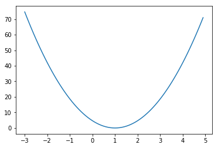

# ML lab 03 - Linear Regression의 cost 최소화의 TensorFlow 구현 (new)


```python
import tensorflow as tf
import matplotlib.pyplot as plt
```

# Variables Initialize


```python
X = [1, 2, 3]
Y = [1, 2, 3]

W = tf.placeholder(tf.float32)
```

# Hypothesis


```python
#hypothesis = Wx
hypothesis = X * W
```


```python
# cost = avg(sum(H - y)2)
cost = tf.reduce_mean(tf.square(hypothesis - Y))
```

# Session start


```python
sess = tf.Session()
sess.run(tf.global_variables_initializer())
```


```python
W_val = []
cost_val = []
for i in range(-30, 50):
    feed_W = i * 0.1
    curr_cost, curr_W = sess.run([cost, W], feed_dict={W: feed_W})
    W_val.append(curr_W)
    cost_val.append(curr_cost)
```

# Visualize


```python
plt.plot(W_val, cost_val)
plt.show()
```




# Gradient descent
우리의 cost 같이 밥그릇 모양의 그래프일 때 사용하는 알고리즘
가장 안쪽의 (1,0)의 점을 찾는 것이 목표

미분 : 한 점의 기울기를 나타냄  
↗ 모양의 경우 +  
↘ 모양의 경우 -  

#### 위와 같은 그래프에서 (4, 50)의 경우
> ↗ 모양이므로 +
W가 1이 되기 위해선 -로 움직여야함

#### 위와 같은 그래프에서 (-2, 40)의 경우
> ↘ 모양이므로 -
W가 1이 되기 위해선 +로 움직여야함

## 수식으로 구현 시
$$
cost(W) = \frac{1}{m}\sum_{i=1}^{m}(Wx^{(i)} - y^{(i)})^{2}
$$

#### 미분한 결과
$$
W := W - a\frac{1}{m}\sum_{i=1}^{m}(Wx^{(i)} - y^{(i)})x^{(i)}
$$
```python
learning_rate = 0.1
gradient = tf.reduce_mean((W * X - Y) *X)
descent = W - learning_rate * gradient
update = W.assign(descent)
```

# Gradient descent 적용


```python
import tensorflow as tf
x_data = [1, 2, 3]
y_data = [1, 2, 3]
```


```python
W = tf.Variable(tf.random_normal([1]), name = 'weight')
X = tf.placeholder(tf.float32)
Y = tf.placeholder(tf.float32)
```


```python
hypothesis = X *  W
```


```python
cost = tf.reduce_sum(tf.square(hypothesis - Y))
```


```python
learning_rate = 0.1
gradient = tf.reduce_mean((W * X - Y) * X)
descent = W - learning_rate * gradient
update = W.assign(descent)
```


```python
sess = tf.Session()
sess.run(tf.global_variables_initializer())

for step in range(21):
    sess.run(update, feed_dict={X: x_data, Y: y_data})
    print(step, sess.run(cost, feed_dict={X: x_data, Y:y_data}), sess.run(W))
```

    0 4.66668 [ 0.42264879]
    1 1.32741 [ 0.69207931]
    2 0.377575 [ 0.83577561]
    3 0.107399 [ 0.91241366]
    4 0.0305491 [ 0.9532873]
    5 0.00868952 [ 0.97508657]
    6 0.00247167 [ 0.98671287]
    7 0.000703047 [ 0.99291354]
    8 0.000199983 [ 0.99622053]
    9 5.68846e-05 [ 0.99798429]
    10 1.61796e-05 [ 0.99892497]
    11 4.60181e-06 [ 0.99942666]
    12 1.30917e-06 [ 0.99969423]
    13 3.72323e-07 [ 0.99983692]
    14 1.05845e-07 [ 0.99991304]
    15 3.01388e-08 [ 0.99995363]
    16 8.55728e-09 [ 0.99997526]
    17 2.43397e-09 [ 0.99998683]
    18 6.87535e-10 [ 0.99999297]
    19 1.96071e-10 [ 0.99999624]
    20 5.89608e-11 [ 0.99999797]


# Minimize : Gradient descent

```python
optimizer = tf.train.GradientDescentOptimizer(learning_rate = 0.1)
train = optimizer.minimize(cost)
```


```python
import tensorflow as tf
X = [1, 2, 3]
Y = [1, 2, 3]
```


```python
#W = tf.Variable(5.0)
W = tf.Variable(-45.0)
```


```python
hypothesis = X *  W
```


```python
cost = tf.reduce_mean(tf.square(hypothesis - Y))
```


```python
optimizer = tf.train.GradientDescentOptimizer(learning_rate=0.1)
train = optimizer.minimize(cost)
```


```python
sess = tf.Session()
sess.run(tf.global_variables_initializer())

for step in range(10):
    print(step, sess.run(W))
    sess.run(train)
```

    0 5.0
    1 5.0
    2 5.0
    3 5.0
    4 5.0
    5 5.0
    6 5.0
    7 5.0
    8 5.0
    9 5.0


# Optional: compute_gradient and apply_gradient

GradientDescentOptimizer를 새로운 식으로 커스텀마이징 하고싶을 때 방법


```python
import tensorflow as tf
X = [1, 2, 3]
Y = [1, 2, 3]
```


```python
W = tf.Variable(5.0)
```


```python
hypothesis = X *  W
```


```python
gradient = tf.reduce_mean((W * X - Y) * X) * 2
```


```python
cost = tf.reduce_mean(tf.square(hypothesis - Y))
optimizer = tf.train.GradientDescentOptimizer(learning_rate=0.1)
```


```python
gvs = optimizer.compute_gradients(cost)
apply_gradients = optimizer.apply_gradients(gvs)
```


```python
sess = tf.Session()
sess.run(tf.global_variables_initializer())

for step in range(10):
    print(step, sess.run([gradient, W]))
    sess.run(apply_gradients)
```

    0 [37.333332, 5.0]
    1 [2.4888866, 1.2666664]
    2 [0.16592591, 1.0177778]
    3 [0.011061668, 1.0011852]
    4 [0.00073742867, 1.000079]
    5 [4.895528e-05, 1.0000052]
    6 [3.0994415e-06, 1.0000004]
    7 [0.0, 1.0]
    8 [0.0, 1.0]
    9 [0.0, 1.0]
