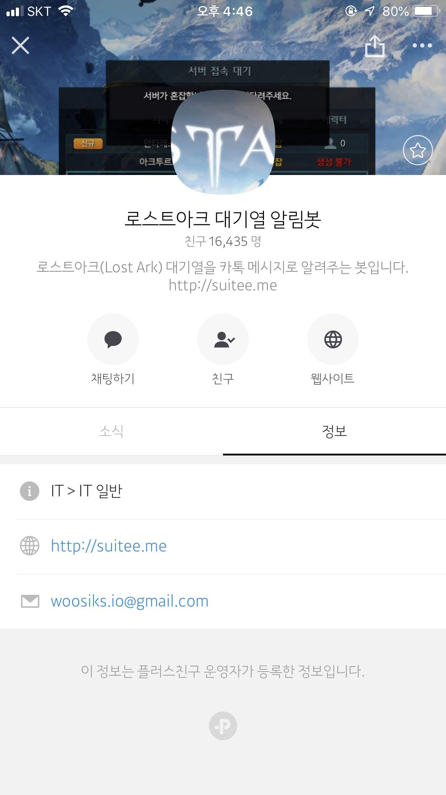
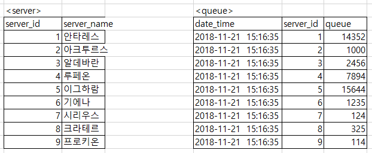
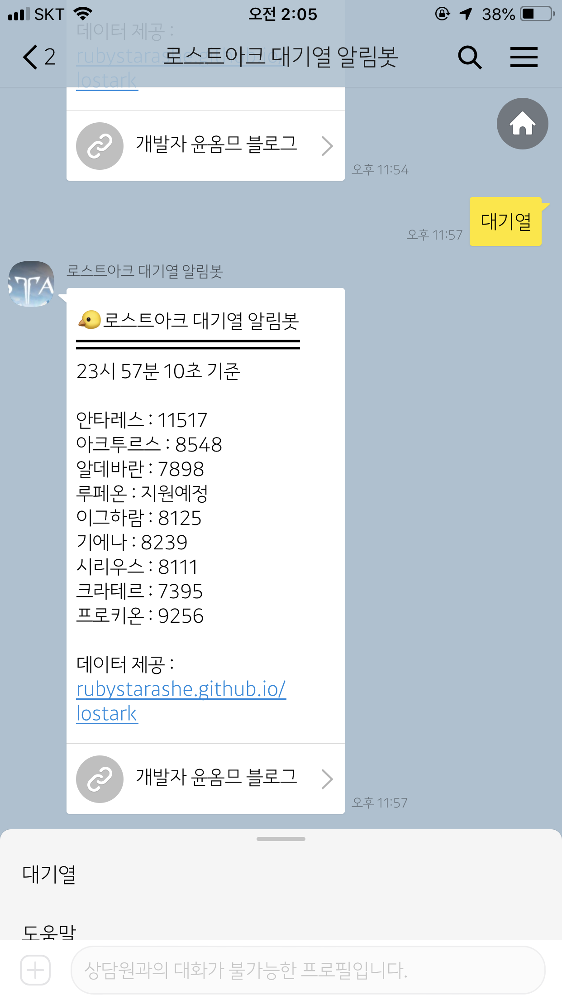

> 서비스 링크 : <https://pf.kakao.com/_dcPGj>  
> Github 링크 : <https://github.com/suitelab/lostark-wait-notifier>




기존 서비스가 loaq측의 요청으로 데이터를 크롤링할 수 없게 되었다.  
~~서비스가 주거버려따..~~  
서비스의 친구수는 점점 늘어가는데 제대로 운영하지 못해서 죄송스러울 따름이었고,
이렇게 수요가 많은 서비스를 꼭 다시 운영해봐야겠다는 생각을 갖고있었다.

그래서 서비스를 중단하고 있는 와중에 <https://rubystarashe.github.io/lostark/>(이하 대기열서비스)를 운영하고 계신  
루비스타님이 데이터 수집을 혼쾌히 허락해주셔서 다시 운영할 수 있게 되었다.

개발 프로세스는 다음과 같이 구상하였다.

1. 대기열 서비스의 데이터를 크롤링한다.
2. 크롤링한 데이터를 가공하여 DB에 저장한다.
3. 스케줄러를 사용한다.
4. 사용자의 요청시 마다 DB에서 데이터를 kakao 플러스친구 api를 통해 서비스 한다.

## 1. 대기열서비스의 데이터를 크롤링한다.
~~크롤러의 경우 selenium를 자주 써봤어서 고려해봤지만 브라우저를 사용하는 selenium 특성상 request당 매번 빠르게 크롤링 해야하는 이번 서비스에는 어울리지 않겠다는 생각이 들었다.~~  
라고 1편에 적었지만 대기열서비스가 렌더링을 통해 생성되기 때문에 일반적인 방법으로는 DOM구조를 수집할 수 없었다.  
그래서 selenium을 통해 브라우징을 하고 긁어온 DOM을 BeautifulSoup를 사용하여 처리했다.  

바로 대기열서비스의 구조를 파악해보자.

#### 데이터가 생성되기 전의 모습
```html
<body data-n-head="">
    <div id="__nuxt">
        <style>
            #nuxt-loading {
                visibility: hidden;
                opacity: 0;
                position: absolute;
                left: 0;
...
```

#### 데이터가 생성된 후의 모습
```html
<div id="__nuxt">
...
  <div class="box">
    <div class="item">
      <span class="data name">안타레스</span>
      <span class="data queue" style="opacity: 1; color: yellow;">9590</span>
    </div>
    <div class="item">
      <span class="data name">아크투르스</span>
      <span class="data queue" style="opacity: 1; color: yellow;">7839</span>
    </div>
...
```

크롤링하기 좋게 구조가 짜여져있다.  
`soup.select()` 메서드로 span tag의 `data name` 태그를 불러오면 서버이름 리스트,  
`data queue` 태그를 불러오면 서버의 대기열 리스트를 가져올 수 있을 것이다.  
그러면 바로 구현해보자.

```py
for i in range(server_count):
    server = soup.select('span.data.name')[i].text
    queue = soup.select('span.data.queue')[i].text

    items.append({"server": server, "queue": queue})
```

## 2. 크롤링한 데이터를 가공하여 DB에 저장한다.
원래 DB까지 쓰고싶지 않았지만 selenium을 사용하게 되니 한번 크롤링하는데 평균 4.5초라는 시간이 걸렸다. 카톡봇에게 대기열 요청하고 약 5초간 기다리게 된다면 매우 끔찍할 것이다.  
그래서 구상한 생각은 selenium 브라우저를 띄워놓고 주기적으로 크롤링을 하여 DB로 저장하는 방법이었다.

DB는 많이 쓰이는 MySql을 사용하였고 테이블 구조는 다음과 같다.



server table에는 최초에 서버리스트를 저장해두고 크롤링 할때마다 queue table에 insert하게 하였다.

```py
def insert_queue_query(self, queues):
    for i, queue in enumerate(queues):
        sql_query = f"INSERT INTO queue(date_time, server_id, queue) VALUES (now(), {i + 1}, {queue['queue']});"
        self.cursor.execute(sql_query)

    self.conn.commit()
    print('{0}개의 정보 업데이트 완료: {1}'.format(len(queues),  str(datetime.now())))
```

그리고 table에 시간당 약 10,000건의 데이터가 들어올 것으로 예상되어 퍼포먼스를 위해 데이터를 일정 주기마다 일부를 삭제하게 하였다.  
만약 통계등의 데이터를 제공하게 된다면 이부분은 다시 고려해봐야 할 것 같다.

```py
def delete_data(self):
    sql = """
    DELETE FROM queue
    ORDER BY date_time ASC LIMIT 9000;
    """
    self.cursor.execute(sql)

    self.conn.commit()
    print('9000개의 정보 삭제 완료: {0}'.format(str(datetime.now())))
```

Crawler class의 __init__부분에서 크롬드라이버가 실행되기 때문에 db에서 데이터를 제공할때 (~~느린~~)크롬드라이버를 실행할 필요는 없었다.

DbTools class 객체를 생성할 때 `select_only` 파라미터를 둠으로써 조회만 사용할 객체의 경우 빠른 속도로 실행할 수 있게 하였다.

```py
class DbTools:
    def __init__(self, select_only = False):
        self.conn = pymysql.connect(host=config.DATABASE_CONFIG["host"],
                                    user=config.DATABASE_CONFIG["user"],
                                    db=config.DATABASE_CONFIG["db"],
                                    password=config.DATABASE_CONFIG["password"],
                                    charset=config.DATABASE_CONFIG["charset"])
        self.cursor = self.conn.cursor()
        self.crawler = None

        if not select_only:
            self.crawler = Crawler()
```

## 3. 스케줄러를 사용한다.
스케줄러는 처음 써봤지만 사용법이 간단해보이는 schedule 모듈을 사용하였다.
다음과  같은 짧은 코드로 스케줄러가 완성되었다.

서버와 별개로 백그라운드로 돌면서 2초마다 크롤링하고 4000초(약 1시간)마다 데이터를 9000건을 삭제하는 스케줄러가 된 것이다.

```py
# schedule.py
db = DbTools(select_only=False)

def insert_schedule():
    db.save_data()

def delete_schedule():
    db.delete_data()

if __name__ == "__main__":
    print("scheduler is running! {}".format(datetime.now()))

    schedule.every(2).seconds.do(insert_schedule)
    schedule.every(4000).seconds.do(delete_schedule)
    while True:
        schedule.run_pending()
        time.sleep(1)
```

## 4. 사용자의 요청시 마다 DB에서 데이터를 kakao 플러스친구 api를 통해 서비스 한다.
kakao api 사용부분은 기존과 크게 변한게 없지만 `message_button` 파라미터를 추가해보았다.  
(~~물론 블로그 홍보라는 사리사욕을 채우기 위해서~~)

```py
data_send["message"].update({'message_button': {'label': '개발자 윤옴므 블로그', 'url': 'http://suitee.me'}})
```



개발자 윤옴므 블로그 라는 버튼이 아주 잘 생성되었다.

## 5. 기타
- server는 AWS EC2의 t3.micro 인스턴스로 Ubuntu를 사용하고 있다.  

- GUI를 설치하지 않은 관계로 putty를 사용하고있는데 당연히 putty를 종료하면 putty로 실행하고 있던 프로그램은 종료가 된다.  
그래서 백그라운드를 돌리는 프로그램으로 원래 node.js용으로 npm에서 제공되는 forever를 사용하였다.  

- 설치 후 해당 디렉토리에서 다음과 같이 명령어를 작성하면 python 서비스지만 아주 정상적으로 작동한다.

```shell
$ forever start -c python3 kakao.py
$ forever start -c python3 scheduler.py
```

- 로스트아크 점검공지사항을 보여주는 기능을 고려중이다. 빠른시일내에 서비스가 제공될 수도 있을것 같다.

- 섬시간 알림 기능도 고려중이다.

- 이번 주말부터 로스트아크가 서버를 대대적으로 증설한다고 한다. 울어야 할지 웃어야 할지... 내 서비스의 존폐 여부가 달려 있을듯 싶다. 물론 대기열이 없으면 더욱 행복할 것 같다 :)


# 🛴
