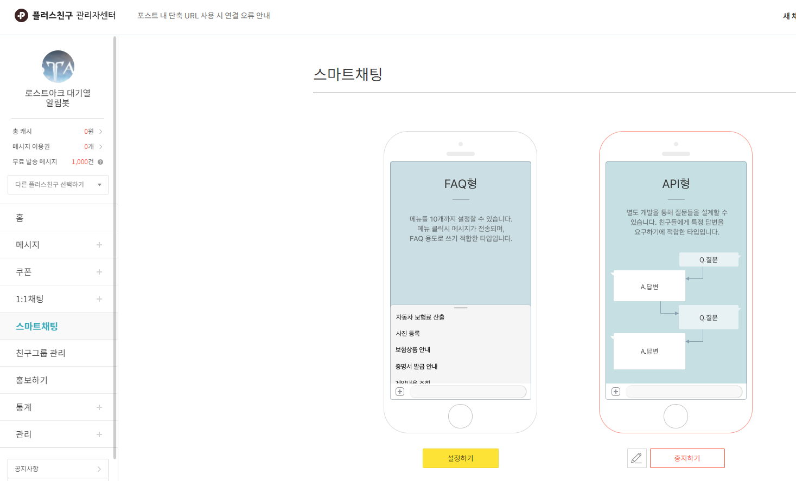

> 서비스 링크 : <https://pf.kakao.com/_dcPGj>  
> Github 링크 : <https://github.com/suitelab/lostark-wait-notifier>

## 들어가기 전에
<http://loaq.kr/>는 데이터 재배포를 금지하고 있습니다!  
이 게시물은 기존에 만들었던 서비스로써 현재의 운영방법이 아닙니다. 후기로만 봐주세요!

현재 운영중인 서비스의 개발 후기는  
<http://suitee.me/2018/11/18/lostark-wait-notifier-2/>에 올려두었습니다.


요즘 로스트아크를 재밌게 즐기고 있다.(~~포스팅이 뜸해지는 원흉~~)  

하지만 좀처럼 줄어들지 않는 대기열때문에 평일 오후 5시, 주말 오전 10시 이후에는 대기열과의 전쟁을 치뤄야한다.  
필자가 플레이하는 서버인 알데바란 기준 평균 대기열은 15,000명 정도 되는 것 같다. 대략 시간을 재본 결과 2시간 넘게 대기를 하였다.  


http://loaq.kr/

로스트아크를 즐겨하는 유저들의 경우 대기열 현황을 볼 수 있는 저 사이트를 꽤나 많이 알고있고 이용할 것이다. 물론 필자도 종종 이용하는 편이다.

매번 사이트에 주소를 치고 들어가 새로고침하는게 귀찮아지던 찰나에 카카오톡 플러스친구 API를 이용하여 대기열 정보를 편하게 카톡으로 받아보면 어떨까 하는 생각이 들게 되었다. 게임플레이와 개발을 동시에 할 수 있는 찬스였다.

loaq.kr의 대기열 데이터의 원천을 알고싶었지만 결국 알아내지 못하였다. 로스트아크 측에서 별도의 API는 제공해주지 않는 것 같았다.  
그리하여 개발 프로세스는 다음과 같이 구상하였다.

1. loaq.kr의 데이터를 크롤링한다.
2. 크롤링한 데이터를 가공하여 json형태로 제공한다.
3. json형태로 제공받은 데이터를 kakao 플러스친구 api를 통해 서비스 한다.

## 1. loaq.kr의 데이터를 크롤링한다.
크롤러의 경우 selenium를 자주 써봤어서 고려해봤지만 브라우저를 사용하는 selenium 특성상 request당 매번 빠르게 크롤링 해야하는 이번 서비스에는 어울리지 않겠다는 생각이 들었다.  
그래서 대중적으로 많이 사랑받는 BeautifulSoup를 사용하였다.

우선 loaq.kr의 구조를 파악했다.

```html
<div class="server-list">
  <div class="row">
    <div class="cell col-center">
        루페온
    </div>
    <div class="cell col-center">
      <div>
        <span class="red">2348</span>
        &nbsp;
      </div>
      <div>
        <span class="small-text bottom-text blue">
          &nbsp;(▼1183)
        </span>
      </div>
    </div>
    <div class="cell col-center">
        <a href="/server/1">상세보기</a>  
    </div>
  </div>
...
```
서버 한개의 row구조는 저렇게 이루어져 있었고 서버명과 대기자 데이터를 끌어오려면 적합한 selector가 div.server-list라고 생각되어서 그렇게 정했다.

공백, (▼1183)와 같은 등락데이터, 상세보기, 테이블의 헤더 등등 불필요한 정보를 정리했다.

```py
for tag in soup.select('div.server-list'):
    server_name += tag.text

server_name = server_name.replace(' ', '').split("\n")

server_name = [x for x in server_name
               if "(" not in x and "상세" not in x and
               "서버" not in x and "대기열" not in x and
               "\xa0" not in x and "" != x]
```

## 2. 크롤링한 데이터를 가공하여 json형태로 제공한다.
정제된 데이터가 준비 되었으니 이제 json으로 제공할 준비를 한다.
```json
{
  "server_time": "2018-11-18 15:49:49",
  "items": [
    {
      "server": "루페온",
      "wait": "13744"
    }
  ]
}
```
json의 형태를 위와 같이 준비해보았다.  
처음으로 만들어보는 api여서 그런지 형태가 아직 성에 차진않는다.  
그래도 이정도 모양새면 어느정도 적절히 필요한 데이터들을 담고 제공할 수 있는 형태가 되었다고 생각된다.

```py
servers = {}
servers['server_time'] = soup.select('div.time')[0].text
.replace("  ","").replace('\n', '')

for i, item in enumerate(server_name):
    if i % 2 == 0:
        items.append({"server": item, "wait": server_name[i + 1]})

servers["items"] = items
```

## 3. json형태로 제공받은 데이터를 kakao 플러스친구 api를 통해 서비스 한다.

처음엔 node.js를 이용해서 비동기 서비스를 제공해볼 생각이었지만 크롤러와 같은 언어를 사용하는 것이 정신건강에 좋을것 같다는 생각이 주마등처럼 스쳐 지나갔다.  
그래서 python의 web framework중 하나인 flask를 사용해보았다.
django는 몇 번 사용해봤지만 flask는 이런 작은 서비스에 어울린다고 생각이 되어서 채택하게 되었다.  

flask에 대한 자세한 내용은 이 글의 주제에서 벗어나기 때문에 다음에 더욱 다뤄보도록 하겠다.  

플러스친구 계정을 만든 후 스마트채팅-API가 사진과 같이 설정 되어있어야한다.

대화방에 첫 진입시 보여줄 keyboard를 정의하는 코드이다.
```py
@app.route('/keyboard')
def Keyboard():
    dataSend = {
        "type": "buttons",
        "buttons": ["대기열", "명령어"]
    }
    return jsonify(dataSend)
```

다음은 각 상황(메뉴)별 시나리오를 구현한 message이다.  
현재 우리의 서비스는 매우 단순하기 때문에 간단하게 구성되어있다.  
keyboard의 대기열 버튼이 클릭되면 데이터를 보여주는 형태이다. 크롤러에서 받아온 json 데이터를 이용해 실제로 보여줄 message를 구성한다.  
마지막에 `dataSend["keyboard"] = {"type": "buttons", "buttons": ["대기열", "명령어"]}` 를 추가하여 모든 화면에서 keyboard가 동작하게 만들어준다.

```py
@app.route('/message', methods=['POST'])
def Message():
    dataReceive = request.get_json()
    content = dataReceive['content']
    if content == u"대기열":
        cr = Crawler()
        json_file = cr.start()

        text = f"서버시간 - {json_file['server_time']}\n\n"

        for item in json_file['items']:
            text += f"{item['server']} - {item['wait']}\n"

        dataSend = {
            "message": {
                "text": text
            }
        }
    elif content == u"명령어":
        dataSend = {
            "message": {
                "text": "1. 대기열\n2. 명령어"
            }
        }
    else:
        dataSend = {
            "message": {
                "text": "명령어를 다시 입력해주세요. 1. 대기열, 2.명령어"
            }
        }

    dataSend["keyboard"] = {"type": "buttons", "buttons": ["대기열", "명령어"]}
    return jsonify(dataSend)
```

하루만에 급조한 프로그램이라 완성도가 많이 떨어지지만 현재도 많은 사람들이 이용해주셔서 감사할 따름이다 😊


<http://www.inven.co.kr/board/lostark/4821/5381>  
로스트아크 인벤에서도 많은 분들이 이용해주시고 계신다.


<https://pf.kakao.com/_dcPGj>

현재 기준으로 3000명을 돌파했다! ❤️❤️❤️  
이번 서비스 개발은 귀찮음을 벗어나려고 시작한 몸부림에 비해 꽤나 보람찬 개발이었다는 생각이 든다.

앞으로도 이런 아이디어가 떠오르면 편리함을 위해 편리함을 개발하는 개발자가 될 것이다.

# 🛴
