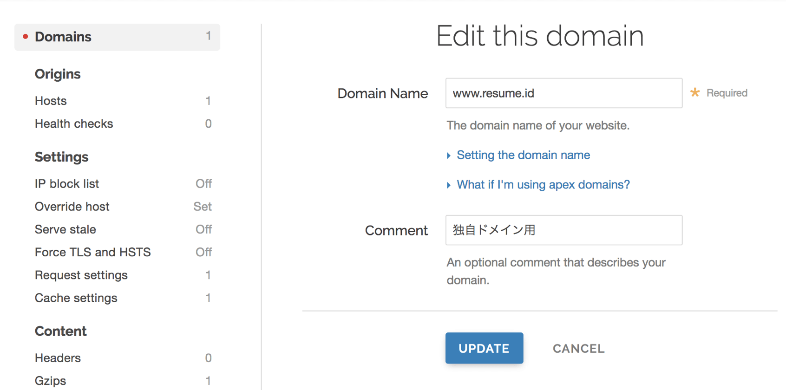

안녕하세요 HEXO에서 왔습네다.

## H2 제목

### H3 제목

#### H4 제목

##### H5 제목

## 항목 나열
항목 나열 입니다.
- Ruby on rails
- Vue.js
- Heroku
- **Fastly**

---

[[simple]]
|🚀주석블럭

```ts:title=hello.ts
const getItem = () => {
  return 'hi';
}
```

[링크](https://dev.to/)

