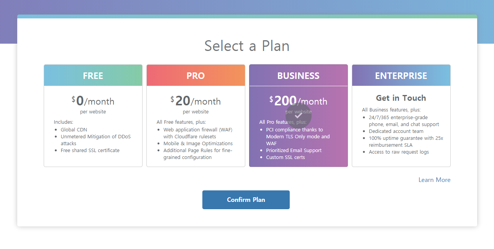
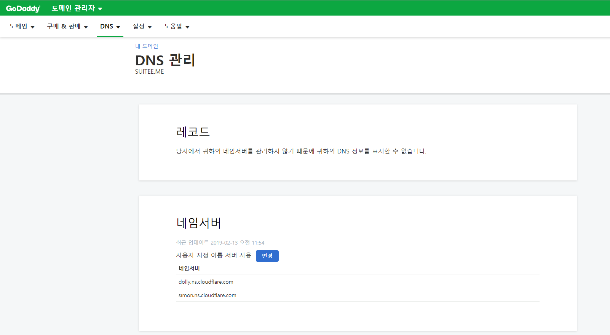

모니터링해본 결과 Github pages를 이용한 블로그는 아래의 방법으로 이용하는 것이 편하고 빠르고 수월할 것이라고 생각한다. 본인의 블로그도 아래의 방법으로 변경하였다.

[무료로 내 블로그에 SSL[HTTPS] 적용하기 - 2](https://fredly.dev/web-how-to-setup-free-ssl-2/)

---

Github pages 블로그를 운영하면서 커스텀 도메인을 사용하고 있었다.  
오늘 웹서핑중에 우연찮게 무료로 SSL을 제공해준다는 서비스를 발견해서 냉큼 사용해보았다.  
결과는 성공적이었다.
github.io에서 지원하던 https를 커스텀 도메인에도 "무료"로 사용할 수 있는 방법을 찾아서 소개해보고자 한다.

## 1. Cloudflare 가입하기

주소: https://www.cloudflare.com/ko-kr/  
우선 Cloudflare 서비스에 가입한다.  
가입방법은 간단하다. 이메일 인증등 일련의 과정을 거치고나서 Plan선택화면이 나온다.  
우리는 무료 서비스를 이용할 것이기 때문에 FREE를 선택해준다.

본인의 블로그 주소를 입력한 뒤 (ex:fredly.dev) 기존에 설정된 dns 레코드들을 확인할 수 있다.  
Continue를 눌러준다.

## 2. Nameserver 설정하기

커스텀 도메인을 구입(관리) 한 사이트로 가서 네임서버를 바꿔주어야 한다.  
해당 사이트로 가서 설정되어있는 도메인(From)을 (TO)로 변경해주면 된다.
본인의 경우 [고대디](https://kr.godaddy.com/)에서 구매했다. (~~.me 도메인이 제일 저렴한 곳이었어서 선택했다.~~)

기존에 설정되어있는 네임서버를 다음과 같이 설정한다.

아까 복사해둔 To칸의 주소들을 붙여넣어준다.

설정이 완료되면 다음과 같이 표시된다.

메일로도 확인메일이 띠링 하고 날라온다.

## 3. HTTP->HTTPS Redirect 설정하기

마지막으로 Crypto메뉴에서 Always Use HTTPS 항목을 On으로 설정해준다.
example.com 로 접속해도 자동으로 https://example.com 으로 Redirect 해주는 기능이다.

## 4. 결과확인

모든 일들이 순탄하게 해결됐다면 시간이 조금 지난 후에 정상적으로 반영이 된 것을 확인할 수 있다.
반영에는 최대 24시간까지 걸릴 수 있다고한다. 본인은 15분정도 소요된 것 같다.
아름다운 초록색 자물쇠가 당신을 반겨줄 것이다.

## 5. 기타 확인할 사항들

글이 길어질 것 같아 다루지 않은 사항들이다. 필요시 검색을 통해 설정해두면 좋을 것 같다.

- Google Search Console에서 https 추가
- Google Analytics https설정
- 기타 https로 전환했을 시 변경해아 할 것들
